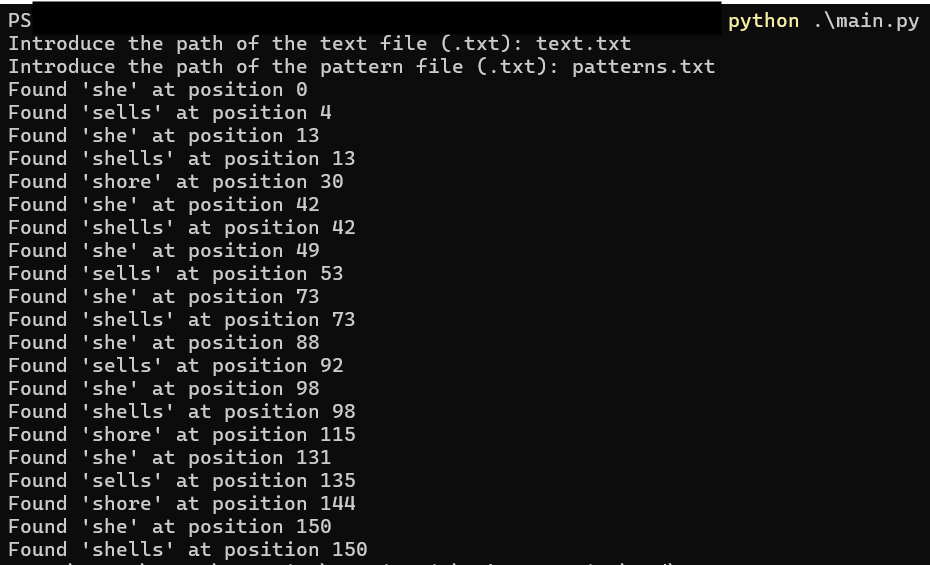

# Pattern Search Tool (Aho-Corasick Algorithm)

This is a Python script that uses the Aho-Corasick algorithm to efficiently search for multiple string patterns in a text file. It reads a list of patterns from a `.txt` file and returns all positions in the text where each pattern is found. The tool is case-insensitive, supports overlapping matches, and automatically detects the encoding of the input files.

---

## Features

- Multi-pattern string matching using Aho-Corasick
- Supports overlapping matches
- Case-insensitive search
- File encoding detection with `chardet`
- Input validation and error handling

---

## Requirements

- Python 3.x
- `chardet` (install with `pip install chardet`)

---

## How to use

1. Run the script:

```bash
python main.py
When prompted:

2. Enter the path to the text file you want to search in (e.g. text.txt)

3. Enter the path to the file containing the patterns (e.g. patterns.txt)

4. Each line in the patterns file should contain one pattern.

---




